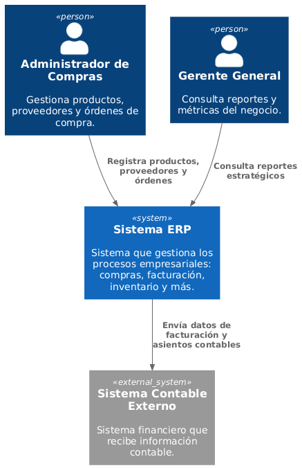
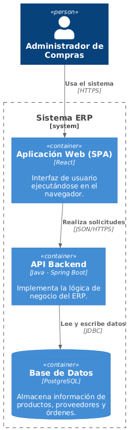
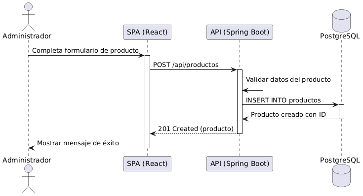

# Sistema ERP – Módulo de Compras

## Introducción y Metas

### Vista de Requerimientos

El sistema ERP tiene como objetivo gestionar el proceso de compras de una organización, permitiendo administrar productos, proveedores y órdenes de compra de forma estructurada y eficiente.

El Módulo de Compras debe permitir:

- Registrar productos
- Registrar proveedores
- Crear órdenes de compra
- Consultar historial de compras
- Validar disponibilidad de productos
- Gestionar estados de órdenes (pendiente, aprobada, cancelada)

### Metas de Calidad

- Seguridad en el acceso a la información
- Alta disponibilidad del sistema
- Escalabilidad
- Mantenibilidad
- Rendimiento adecuado en consultas

### Partes interesadas (Stakeholders)

| Rol | Expectativa |
|------|------------|
| Administrador | Control total del sistema |
| Usuario de Compras | Registrar y gestionar órdenes |
| Gerencia | Consultar reportes y estados |

---

# Restricciones de la Arquitectura

- Backend desarrollado en **Java con Spring Boot**
- Base de datos **PostgreSQL**
- Frontend como **SPA con React**
- Arquitectura basada en contenedores
- Uso de API REST para comunicación

---

# Alcance y Contexto del Sistema

## Contexto de Negocio

El sistema interactúa con:

- Usuarios internos
- Sistema de inventario
- Proveedores externos

### Diagrama de Contexto (C1)

---

## Contexto Técnico

El sistema está compuesto por:

- Aplicación Web (Frontend)
- API REST (Backend)
- Base de Datos PostgreSQL

---

# Estrategia de Solución

Se adopta una arquitectura en capas:

- Capa de Presentación (React)
- Capa de Negocio (Spring Boot)
- Capa de Persistencia (PostgreSQL)

Se utiliza una API REST para comunicación entre frontend y backend.

---

# Vista de Bloques

## Sistema General

El sistema está compuesto por tres contenedores principales:

- Frontend (React SPA)
- Backend (Spring Boot API)
- Base de Datos (PostgreSQL)

### Diagrama de Contenedores (C2)

### Responsabilidad de cada contenedor

**Frontend**
- Interfaz de usuario
- Formularios de registro
- Visualización de datos

**Backend**
- Lógica de negocio
- Validaciones
- Gestión de órdenes y proveedores
- Exposición de API REST

**Base de Datos**
- Almacenamiento persistente
- Gestión de entidades del dominio

---

# Vista de Ejecución

## Escenario: Registrar Producto

Flujo:

1. Usuario ingresa datos del producto en el frontend.
2. Frontend envía solicitud POST al backend.
3. Backend valida datos.
4. Backend guarda información en PostgreSQL.
5. Backend responde con confirmación.
6. Frontend muestra mensaje de éxito.

### Diagrama de Secuencia

---

# Vista de Despliegue

El sistema puede desplegarse en:

- Servidor Linux
- Docker para contenerización
- Base de datos en servidor dedicado o servicio cloud

Arquitectura sugerida:

- Contenedor 1: Frontend
- Contenedor 2: Backend
- Contenedor 3: PostgreSQL

---

# Modelo de Datos

### Diagrama Entidad-Relación (MER)

Entidades principales:

- Producto
- Proveedor
- OrdenCompra
- DetalleOrden

---

# Conceptos Transversales

- Seguridad mediante autenticación
- Manejo de errores centralizado
- Validaciones de datos en backend
- Control de acceso por roles

---

# Decisiones de Diseño

- Uso de arquitectura en capas
- API REST para desacoplamiento
- Base de datos relacional
- Separación clara entre frontend y backend

---

# Requerimientos de Calidad

- Tiempo de respuesta menor a 2 segundos
- Integridad de datos
- Disponibilidad 99%
- Escalabilidad horizontal mediante contenedores

---

# Riesgos y deuda técnica

- Dependencia de la base de datos
- Posible sobrecarga si no se optimizan consultas
- Necesidad futura de balanceador de carga

---

# Glosario

| Término | Definición |
|----------|------------|
| Producto | Bien adquirido por la empresa |
| Proveedor | Entidad que suministra productos |
| Orden de Compra | Documento que formaliza la compra |
| API REST | Interfaz de comunicación entre sistemas |
